<picture>
  <source media="(prefers-color-scheme: dark)" srcset="assets/header-dark.svg">
  <source media="(prefers-color-scheme: light)" srcset="assets/header-light.svg">
  
</picture>

<picture>
  <source media="(prefers-color-scheme: dark)" srcset="assets/ticker-dark.svg">
  <source media="(prefers-color-scheme: light)" srcset="assets/ticker-light.svg">
  
</picture>

<picture>
  <source media="(prefers-color-scheme: dark)" srcset="assets/available-dark.svg">
  <source media="(prefers-color-scheme: light)" srcset="assets/available-light.svg">
  
</picture>

 

<picture>
  <source media="(prefers-color-scheme: dark)" srcset="assets/l-work-dark.svg">
  <source media="(prefers-color-scheme: light)" srcset="assets/l-work-light.svg">
  
</picture>

001&nbsp;&nbsp;**Personal site for a bestselling author**

She writes and speaks about technology and human awareness, so the site had to sound like her and not like a template. Bilingual and live in production: home, biography, work, the book, contacts. The work section pulls six separate activities under a single question about who decides and by which criteria, and that question is what holds the page together. I kept the design quiet on purpose. One portrait, very large type, a single accent colour, and scrolling used to carry the story instead of decorating it. Research, structure, copy layout, design and build.

<picture>
  <source media="(prefers-color-scheme: dark)" srcset="assets/rule-dark.svg">
  <source media="(prefers-color-scheme: light)" srcset="assets/rule-light.svg">
  
</picture>

002&nbsp;&nbsp;**Microsite for a book on technological humanism**

The book collects thirty principles that put ancient thinking and new tools in the same room. I took the tone and the palette straight from the cover and set them in motion, so the site feels like the object it presents. One idea per section, with enough space around it that the reader slows down. Bilingual, built to grow with talks and events as they are announced.

<picture>
  <source media="(prefers-color-scheme: dark)" srcset="assets/rule-dark.svg">
  <source media="(prefers-color-scheme: light)" srcset="assets/rule-light.svg">
  
</picture>

003&nbsp;&nbsp;**Artist site for an international DJ and producer**

Not a laid out site but one continuous experience. A single bilingual page where scrolling moves the narrative forward and every visual decision comes from the artist's own material rather than from a theme. Real time 3D running in the browser, typography drawn for this project alone, and a press kit delivered behind a gate so the material stays under control. Designed and built end to end, from the first idea to the live deployment.

<picture>
  <source media="(prefers-color-scheme: dark)" srcset="assets/rule-dark.svg">
  <source media="(prefers-color-scheme: light)" srcset="assets/rule-light.svg">
  
</picture>

004&nbsp;&nbsp;**Ongoing**

Interfaces, workflows assisted by language models, small internal tools that remove repetitive work. Some of it is client work, some of it exists only to answer a question I had.

Client work is under NDA. I can walk you through any of it in a call.

 

<picture>
  <source media="(prefers-color-scheme: dark)" srcset="assets/l-abroad-dark.svg">
  <source media="(prefers-color-scheme: light)" srcset="assets/l-abroad-light.svg">
  
</picture>

001&nbsp;&nbsp;**Silicon Valley**

One week inside the companies I had only read about, Google, Apple, Tesla and Pure Storage, in meetings with founders, managers and investors rather than on a guided tour. I went to see how decisions are taken when the stakes are real, how a product gets killed, how a team is rebuilt around a new direction. I could not afford the trip, so I ran a public crowdfunding campaign, explained the project and raised the money myself. That part taught me as much as the week did.

<picture>
  <source media="(prefers-color-scheme: dark)" srcset="assets/rule-dark.svg">
  <source media="(prefers-color-scheme: light)" srcset="assets/rule-light.svg">
  
</picture>

002&nbsp;&nbsp;**Oro di Calabria**

A venture building programme under the patronage of the European Commission. Twenty four people selected out of eighty, after an application, a written idea and an interview in front of the selection board. Four residential days in a team of strangers, from a raw idea to a pitch in front of investors, bankers and academics, with expert critique every single evening. I learned to frame the real problem before proposing anything, to test an assumption cheaply instead of falling in love with it, and to hold a room while under pressure.

<picture>
  <source media="(prefers-color-scheme: dark)" srcset="assets/rule-dark.svg">
  <source media="(prefers-color-scheme: light)" srcset="assets/rule-light.svg">
  
</picture>

003&nbsp;&nbsp;**New York**

Four weeks of English and daily group work in a class where nobody shared my language. I ended up leading the study group and was voted best student of the class. It is the first place where I understood that speaking well matters as much as knowing the answer.

<picture>
  <source media="(prefers-color-scheme: dark)" srcset="assets/rule-dark.svg">
  <source media="(prefers-color-scheme: light)" srcset="assets/rule-light.svg">
  
</picture>

004&nbsp;&nbsp;**Oxford**

Four weeks in England, in a classroom in the morning and in the city for the rest of the day, closing with a B2 certification. In Oxford nobody is impressed by ambition, they are impressed by precision. I started paying attention to how people build an argument before they raise their voice.

<picture>
  <source media="(prefers-color-scheme: dark)" srcset="assets/rule-dark.svg">
  <source media="(prefers-color-scheme: light)" srcset="assets/rule-light.svg">
  
</picture>

005&nbsp;&nbsp;**Toronto**

Four weeks in Canada and a B1 certification, my first long stay far from home. Different accents in the same room every day, from people who had crossed an ocean for the same reason I had. It is where the language stopped being a school subject and became the thing I needed in order to be understood.

<picture>
  <source media="(prefers-color-scheme: dark)" srcset="assets/rule-dark.svg">
  <source media="(prefers-color-scheme: light)" srcset="assets/rule-light.svg">
  
</picture>

006&nbsp;&nbsp;**Barcelona**

Two weeks of Spanish from zero to A1. Short, intense, and useful in a way I did not expect: starting a language again from nothing, at an age when you are supposed to already know things, teaches you how to be a beginner without being embarrassed about it. I use that more often than the Spanish.
