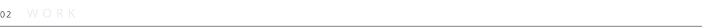
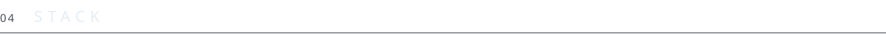

<picture>
  <source media="(prefers-color-scheme: dark)" srcset="assets/header-dark.svg">
  <source media="(prefers-color-scheme: light)" srcset="assets/header-light.svg">
  
</picture>

<picture>
  <source media="(prefers-color-scheme: dark)" srcset="assets/ticker-dark.svg">
  <source media="(prefers-color-scheme: light)" srcset="assets/ticker-light.svg">
  
</picture>

 

I grew up in a small town in Calabria and I kept leaving it to learn where things actually happen.
I build web products with artificial intelligence inside them, and I work best next to people who already know where they are going.
Before I write code I look at the problem from every side I can find.

<picture>
  <source media="(prefers-color-scheme: dark)" srcset="assets/available-dark.svg">
  <source media="(prefers-color-scheme: light)" srcset="assets/available-light.svg">
  
</picture>

 
 

<picture>
  <source media="(prefers-color-scheme: dark)" srcset="assets/s01-dark.svg">
  <source media="(prefers-color-scheme: light)" srcset="assets/s01-light.svg">
  
</picture>

| | |
|---|---|
| **Personal site for a bestselling author** | Bilingual editorial site on technology and human awareness. Scrolling carries the story. One portrait, one accent, nothing else. |
| **Book microsite** | Companion site for an essay on technological humanism. Tone and palette taken from the cover, then set in motion. |
| **Artist site for an international DJ** | One continuous bilingual page. Real time 3D, custom typography, press kit behind a gate. Built from nothing, no template. |
| **Ongoing** | Interfaces, AI assisted workflows, internal tools. |

Client work under NDA. I can walk you through any of it.

 

<picture>
  <source media="(prefers-color-scheme: dark)" srcset="assets/s02-dark.svg">
  <source media="(prefers-color-scheme: light)" srcset="assets/s02-light.svg">
  
</picture>

| | |
|---|---|
| **Silicon Valley** | A week inside Google, Apple, Tesla and Pure Storage, talking to founders and managers. I paid for the trip with a crowdfunding campaign I ran myself. |
| **Oro di Calabria** | Venture building programme under the patronage of the European Commission. Twenty four people selected out of eighty. From raw idea to pitch in front of investors and bankers in four days. |
| **New York** | Four weeks of English and group work. Voted best student of the class. |
| **Oxford, Toronto, Barcelona** | Three more stays, three more languages in the room, one lesson repeated every time: you learn faster when nobody speaks your language. |

 

<picture>
  <source media="(prefers-color-scheme: dark)" srcset="assets/s03-dark.svg">
  <source media="(prefers-color-scheme: light)" srcset="assets/s03-light.svg">
  
</picture>

`Google AI Professional` &nbsp;·&nbsp; `IBM Large Language Models` &nbsp;·&nbsp; `Anthropic Claude Code Academy` &nbsp;·&nbsp; `Cisco Cybersecurity`

 

<picture>
  <source media="(prefers-color-scheme: dark)" srcset="assets/s04-dark.svg">
  <source media="(prefers-color-scheme: light)" srcset="assets/s04-light.svg">
  
</picture>

[LinkedIn](https://www.linkedin.com/in/francescocimino/) &nbsp;·&nbsp; [Instagram](https://www.instagram.com/francescocimino_ig/)
